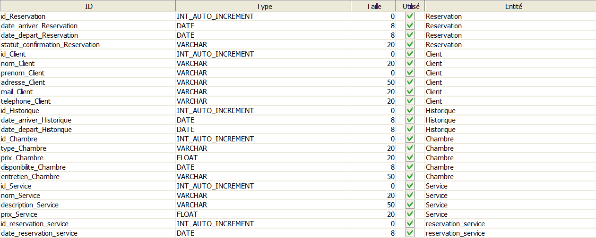
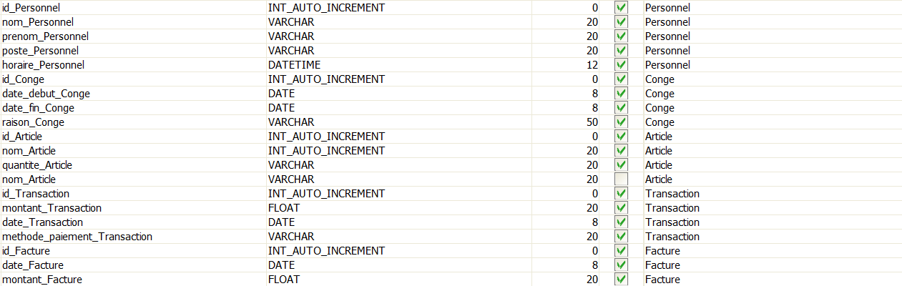
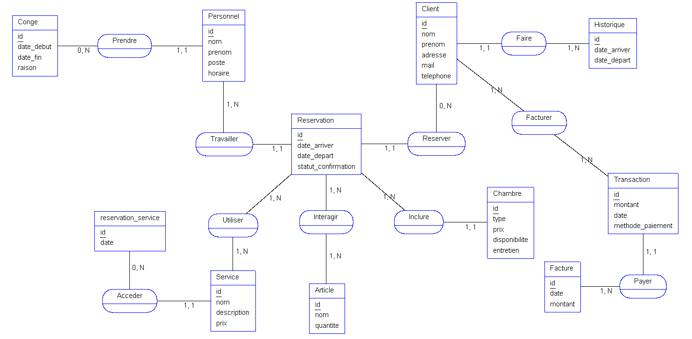
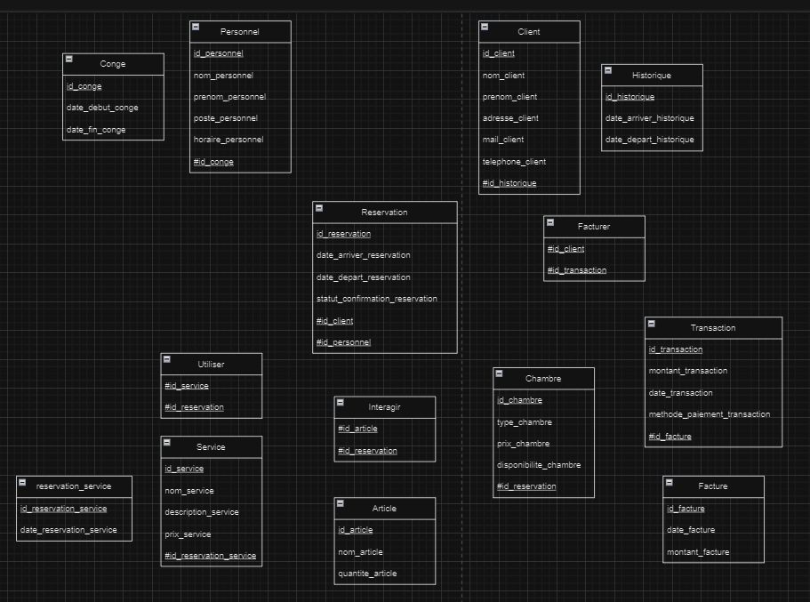

# Examen Modelisation de donnees

## Enoncé du projet :

Une chaîne hôtelière de luxe souhaite moderniser son système de gestion pour optimiser ses opérations, offrir une expérience client exceptionnelle et améliorer l'efficacité de son personnel. Vous êtes sollicité en tant que consultant en systèmes d'information pour concevoir un système de gestion intégré, couvrant tous les aspects de l'entreprise, en utilisant la méthode MERISE.

Le système de gestion intégré doit inclure les modules suivants :

- Gestion des réservations : Permettre aux clients de réserver des chambres, de vérifier leur disponibilité et de recevoir des confirmations de réservation.
- Gestion des clients : Enregistrer les informations des clients, suivre leur historique de séjour et proposer des offres personnalisées en fonction de leurs préférences.
- Gestion des chambres : Suivre l'état des chambres, leur disponibilité, leur tarification et leur entretien.
- Gestion des services : Faciliter la réservation de services supplémentaires tels que les transferts, les activités spéciales et les repas.
- Gestion du personnel : Suivre les horaires, les congés, les formations et les performances du personnel de l'hôtel.
- Gestion des stocks : Gérer les stocks d'articles utilisés par l'hôtel, tels que les articles de toilette, les produits de nettoyage, etc.
- Gestion financière : Enregistrer les transactions financières, gérer la facturation des clients et produire des rapports financiers.
- Analyse et rapports : Fournir des outils d'analyse pour évaluer les performances de l'hôtel, la satisfaction des clients, etc.

### Le dictionnaire de donnees : (AnalyseSI)




### Le MCD : (AnalyseSI)



### Le MLD : (draw.io)



### Le MPD :

#### Le schema relationnel :

Reservation (id_Reservation, date_arriver_Reservation, date_depart_Reservation, statut_confirmation_Reservation, #id_Client, #id_Personnel)  

Client (id_Client, nom_Client, prenom_Client, adresse_Client, mail_Client, telephone_Client, #id_Historique)  

Chambre (id_Chambre, type_Chambre, prix_Chambre, disponibilite_Chambre, entretien_Chambre, #id_Reservation)  

Service (id_Service, nom_Service, description_Service, prix_Service, #id_reservation_service)  

reservation_service (id_reservation_service, date_reservation_service)  

Historique (id_Historique, date_arriver_Historique, date_depart_Historique)  

Personnel (id_Personnel, nom_Personnel, prenom_Personnel, poste_Personnel, horaire_Personnel, #id_Conge)  

Conge (id_Conge, date_debut_Conge, date_fin_Conge, raison_Conge)  

Article (id_Article, nom_Article, quantite_Article)  

Transaction (id_Transaction, montant_Transaction, date_Transaction, methode_paiement_Transaction, #id_Facture)  

Facture (id_Facture, date_Facture, montant_Facture)  

Facturer (#id_Client, #id_Transaction)  

Utiliser (#id_Service, #id_Reservation)  

Interagir (#id_Article, #id_Reservation) 

#### Le script SQL :

```SQL
CREATE TABLE Reservation 
(
    id_Reservation INT AUTO_INCREMENT NOT NULL, 
    date_arriver_Reservation DATE, 
    date_depart_Reservation DATE, 
    statut_confirmation_Reservation VARCHAR(20), 
    id_Client INT AUTO_INCREMENT, 
    id_Personnel INT AUTO_INCREMENT
, 
PRIMARY KEY (id_Reservation) CONSTRAINT Reservation
);

CREATE TABLE Client 
(
    id_Client INT AUTO_INCREMENT NOT NULL, 
    nom_Client VARCHAR(20), 
    prenom_Client VARCHAR, 
    adresse_Client VARCHAR(50), 
    mail_Client VARCHAR(20), 
    telephone_Client VARCHAR(20), 
    id_Historique INT AUTO_INCREMENT
, 
PRIMARY KEY (id_Client) CONSTRAINT Client
);

CREATE TABLE Chambre 
(
    id_Chambre INT AUTO_INCREMENT NOT NULL, 
    type_Chambre VARCHAR(20), 
    prix_Chambre FLOAT(20), 
    disponibilite_Chambre DATE, 
    entretien_Chambre VARCHAR(50), 
    id_Reservation INT AUTO_INCREMENT
, 
PRIMARY KEY (id_Chambre) CONSTRAINT Chambre
); 

CREATE TABLE Service 
(
    id_Service INT AUTO_INCREMENT NOT NULL, 
    nom_Service VARCHAR(20), 
    description_Service VARCHAR(50), 
    prix_Service FLOAT(20), 
    id_reservation_service INT AUTO_INCREMENT
, 
PRIMARY KEY (id_Service) CONSTRAINT Service
);

CREATE TABLE reservation_service 
(
    id_reservation_service INT AUTO_INCREMENT NOT NULL, 
    date_reservation_service DATE
, 
PRIMARY KEY (id_reservation_service) CONSTRAINT reservation_service
);

CREATE TABLE Historique 
(
    id_Historique INT AUTO_INCREMENT NOT NULL, 
    date_arriver_Historique DATE, 
    date_depart_Historique DATE
, 
PRIMARY KEY (id_Historique) CONSTRAINT Historique
);

CREATE TABLE Personnel 
(
    id_Personnel INT AUTO_INCREMENT NOT NULL, 
    nom_Personnel VARCHAR(20), 
    prenom_Personnel VARCHAR(20), 
    poste_Personnel VARCHAR(20), 
    horaire_Personnel DATETIME, 
    id_Conge INT AUTO_INCREMENT
, 
PRIMARY KEY (id_Personnel) CONSTRAINT Personnel
); 

CREATE TABLE Conge 
(
    id_Conge INT AUTO_INCREMENT NOT NULL, 
    date_debut_Conge DATE, 
    date_fin_Conge DATE, 
    raison_Conge VARCHAR(50)
, 
PRIMARY KEY (id_Conge) CONSTRAINT Conge
);

CREATE TABLE Article 
(
    id_Article INT AUTO_INCREMENT NOT NULL, 
    nom_Article INT(20), 
    quantite_Article VARCHAR(20)
, 
PRIMARY KEY (id_Article) CONSTRAINT Article
); 

CREATE TABLE Transaction 
(
    id_Transaction INT AUTO_INCREMENT NOT NULL, 
    montant_Transaction FLOAT(20), 
    date_Transaction DATE, 
    methode_paiement_Transaction VARCHAR(20), 
    id_Facture INT AUTO_INCREMENT
, 
PRIMARY KEY (id_Transaction) CONSTRAINT Transaction
);

CREATE TABLE Facture 
(
    id_Facture INT AUTO_INCREMENT NOT NULL, 
    date_Facture DATE, 
    montant_Facture FLOAT(20)
, 
PRIMARY KEY (id_Facture) CONSTRAINT Facture
);

CREATE TABLE Facturer 
(
    id_Client INT AUTO_INCREMENT NOT NULL, 
    id_Transaction INT AUTO_INCREMENT NOT NULL
, 
PRIMARY KEY (id_Client,  id_Transaction) CONSTRAINT Facturer
);

CREATE TABLE Utiliser 
(
    id_Service INT AUTO_INCREMENT NOT NULL, 
    id_Reservation INT AUTO_INCREMENT NOT NULL
, 
PRIMARY KEY (id_Service,  id_Reservation) CONSTRAINT Utiliser
);

CREATE TABLE Interagir 
(
    id_Article INT AUTO_INCREMENT NOT NULL, 
    id_Reservation INT AUTO_INCREMENT NOT NULL
, 
PRIMARY KEY (id_Article,  id_Reservation) CONSTRAINT Interagir
);
```
